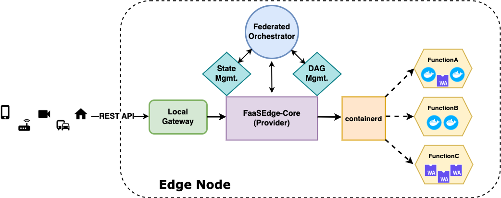

# FaaSEdge Core

Core is an implementation of RUNE and the execution engine for the FaaSEdge project at Georgia Tech. It is responsible for managing the lifecycle of process-based containers and WASM containers that run serverless functions. It is based on the [faasd provider](https://github.com/openfaas/faasd) from the [OpenFaaS](https://github.com/openfaas) project.

Similar to faasd, it relies on [containerd](https://containerd.io/) and [Container Networking Interface (CNI)](https://github.com/containernetworking/cni) for low-level container orchestration and management, but extends the original functionality to include support for different container types (e.g., WASM) and more robust function management policies (e.g., separate containers for each function invocation).




## Features

- Single container per invocation
- Recycling warm (active) and cold (inactive) container
- Background cleanup for cold containers
- Run functions in traditional processed-based containers and/or WASM containers

## Installation

For manual installation instructions see the [Setup documentation](docs/SETUP.md).

## Development

For instructions on how to develop fecore, see the [Code documentation](docs/CODE.md).

## Running fecore

Before attempting to run `fecore`, ensure you have satisfied all setup dependencies.

`fecore` is a single, statically compiled binary. It can be run with a gateway (such as the OpenFaaS gateway) or standalone, in which it functions as its own gateway.

You can start the `fecore` server with the following command:
```
sudo su
cd /usr/local/bin
secret_mount_path=/var/lib/fecore/secrets fecore provider
```
`fecore` will bind to port 8081 on IP address 10.62.0.1 by default.
Pressing `Ctrl+C` will cause `fecore` to catch the signal, clean up, and exit.

## Example Usage

You can interact with `fecore` using the `faas-cli` tool from OpenFaaS.

Deploy a native (process-based container) Function:
```
faas-cli -g 10.62.0.1:8081 deploy --image url.to.container.registry/example:latest --name example-n --label ctrType=native
```

Invoke the function
```
curl http://10.62.0.1:8081/function/example-n
```

For more advanced use cases, see the [Usage documentation](docs/USAGE.md).